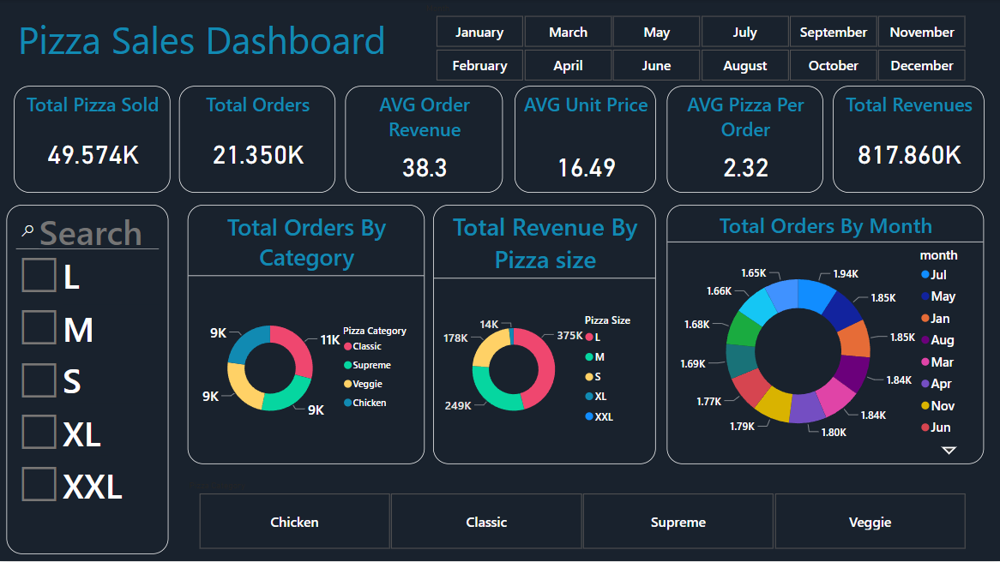

# Pizza Sales Project
Pizza Sales Data analysis using   SQL + Power BI + Power Query

# Table of Contents
1.Introduction

2.Overview Dashboard

3.Dataset

4.SQL

6.Power Query

7.Usage

# Intoduction
This project aims to analysis pizza sales dataset using  SQl and Power BI

# Overview Dashboard

Process of the project

This project analyze pizza sales dataset and get insights from this data to help the stakeholders to undersand thje data and how it's gone.
First I  go to SQL to answer to some KPIs the stakeholder asks for and finally I gone to Power BI to visual my interactive dashboard to make it better to understood.

# Dataset

The dataset contains the following columns:

pizza id

order id

pizza name id

quantity

order date

order time

unit price

total price

pizza size

pizza category 

pizza ingredents

pizza name

to access dataset [Click Here]()

# SQL
SQl queries
KPI's
1.AVG order revenue 
2.AVG pizza per order
3.Total pizza sold
4.Total orders
5.Total Revenue
6.Total Orders by month 
7.Total Orders by category
8.Total revenue by pizza size 
9.AVG unit price 

to Download the SQL KPIs documentation ![Pizza restaurant KPI-s queries]

